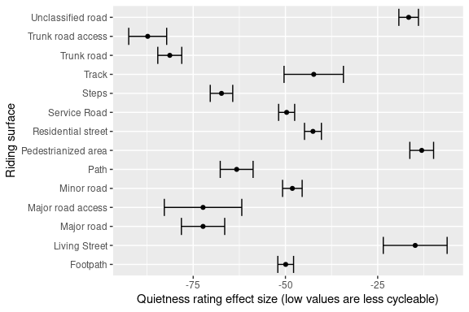
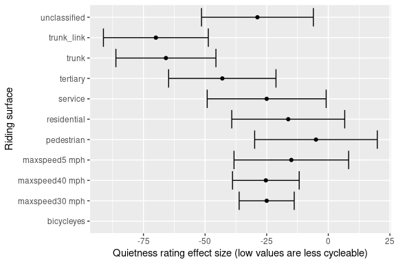

This repo contains ideas, code, and example data to estimate
‘cyclability’ on transport networks. At present it is focussed on
cycling because there are more readily available datasets for cycling
than for walking that we are aware of. However at some point we would
like to extend this to walking and other modes, in which case the repo
may be renamed (e.g. to `activability` if nobody comes up with a better
name ; ).

## What is cyclability?

There are at least three definitions of how conducive to cycling
different places, routes and segments of travel networks are:

- [Level of Traffic
  Stress](https://docs.conveyal.com/learn-more/traffic-stress) (LTS)
- [Bikeability](https://www.britishcycling.org.uk/cycletraining/article/ct20110111-cycletraining-What-is-Bikeability-0)
  levels, which rates infrastructure based on the level of training
  needed to feel comfortable:
  - Level 1 teaches basic bike-handling skills in a controlled
    traffic-free environment.
  - Level 2 teaches trainees to cycle planned routes on minor roads,
    offering a real cycling experience.
  - Level 3 ensures trainees are able to manage a variety of traffic
    conditions and is delivered on busier roads with advanced features
    and layouts
- CycleStreets’s [Quietness
  rating](https://www.cyclestreets.net/help/journey/howitworks/#quietness)
  from 1 (very unpleasant for cycling) to 100 (the quietest)
  - The [BNA tool](https://bna.peopleforbikes.org/#/) which builds on
    the concept of traffic stress to classify segments as Low Stress or
    High Stress.

## Example data

### Data from Leeds, UK

Datasets containing estimates of ‘quietness’ and ‘cyclability’ for
Leeds, UK, are available from the a separate
[repo](https://github.com/ITSLeeds/cyclability/). These datasets were
taken from an area with the following bounding box:

         xmin      ymin      xmax      ymax 
    -1.571467 53.797790 -1.541108 53.815759 

This area, representing a 1 km boundary around the University of Leeds
(-1.556288, 53.80677) can be seen in OSM at the following URL:
https://www.openstreetmap.org/#map=16/53.8068/-1.5563

To generate a GeoJSON version of the input data we used the
`osmtogeojson` command line utility which can be installed on Ubuntu
with the following command:

``` bash
sudo npm install -g osmtogeojson
```

#### OSM data

OSM data was downloaded from overpass with the following command which
uses `wget` to query the API for the bounding box:

``` bash
 #| eval: false
wget -O example-data/leeds.osm "https://overpass-api.de/api/interpreter?data=[out:xml][timeout:25];(way[highway](53.797790,-1.571467,53.815759,-1.541108);node(w););out body;>;out skel qt;"
```

The output of the command above can be found in the `example-data`
folder of this repo.

``` bash
osmtogeojson example-data/leeds.osm > example-data/leeds.geojson
```

<!-- Convert this to GeoJSON with the following command (requires `osmium-tool`): -->

The first 10 keys in the OSM dataset that have at least one value are:

     [1] "area"                         "bicycle"                     
     [3] "bicycle:backward:conditional" "bicycle:conditional"         
     [5] "bicycle:forward:conditional"  "bollard"                     
     [7] "cycleway:buffer"              "foot"                        
     [9] "footway"                      "footway:surface"             

The OSM data can be seen in the map below:


The example dataset contains around 3k line segments and 200 keys with
at least one value. The number of features by geometry type is shown in
the table below.

| geometry_type |    n |
|:--------------|-----:|
| POINT         |  890 |
| LINESTRING    | 2969 |
| POLYGON       |   34 |

#### Quietness

A GeoJSON file with quietness estimates for each road segment in Leeds
is available at
https://github.com/ITSLeeds/cyclability/raw/main/cyclestreets/leeds_quietness.geojson
and is illustrated below:


| name              | ridingSurface      |      id | cyclableText | quietness | speedMph | speedKmph | pause | color    |
|:------------------|:-------------------|--------:|:-------------|----------:|---------:|----------:|------:|:---------|
| Hanover Way       | Minor road         | 1709456 | Yes          |        40 |       16 |        26 |     0 | \#9295FF |
| Hyde Place        | Residential street | 1709460 | Yes          |        60 |       15 |        24 |     0 | \#B06840 |
| Buckingham Avenue | Residential street | 2956857 | Yes          |        40 |       15 |        24 |     0 | \#9295FF |

A simple model was used to find out the relationship between the
quietness rating and riding surface, resulting in the following plot:



From this we can see that, as would be expected, living streets and
pedestrianised areas are associated with the highest quietness ratings.
The model also reveals that, for the sample data in Leeds at least, the
segment type alone can explain 67% of the variation in quietness
ratings. The dependent variables shown in the plot above are produced by
CycleStreets which were themselves derived from OSM data. Let’s try to
reproduce the quietness ratings using the OSM data directly. To do that,
we first need to join the data from CycleStreets with the OSM data.

The OSM data contains ids such as:

``` r
leeds_osm_geojson$id[1:3]
```

    [1] "way/8094922"  "way/22770533" "way/25158101"

The CycleStreets data contains ids such as:

``` r
leeds_quietness$id[1:3]
```

    [1] 1709456 1709460 2956857

After removing everything before and including the `/` character, the
ids are the same, with the majority of the ids in the CycleStreets data
present in the OSM data:

``` r
leeds_osm_geojson$id = gsub(".*\\/", "", leeds_osm_geojson$id)
summary(leeds_quietness$id %in% leeds_osm_geojson$id)
```

       Mode   FALSE    TRUE 
    logical      33    2712 

    Warning: There was 1 warning in `dplyr::mutate()`.
    ℹ In argument: `id = as.integer(id)`.
    Caused by warning:
    ! NAs introduced by coercion to integer range

Of the 200+ keys in the OSM data, only a few appear frequently enough to
be useful for modelling. The keys that most frequently have values are
shown in the table below:

| name           |    n | most_common_value | most_common_value_count |
|:---------------|-----:|:------------------|------------------------:|
| highway        | 3358 | footway           |                    1038 |
| name           | 1102 | Woodhouse Lane    |                      48 |
| surface        |  815 | asphalt           |                     495 |
| maxspeed       |  572 | 20 mph            |                     337 |
| oneway         |  418 | yes               |                     376 |
| source         |  382 | survey            |                     148 |
| lanes          |  376 | 2                 |                     187 |
| lit            |  364 | yes               |                     308 |
| bicycle        |  336 | yes               |                     243 |
| barrier        |  307 | gate              |                     159 |
| access         |  271 | private           |                     138 |
| foot           |  261 | yes               |                     163 |
| crossing       |  203 | traffic_signals   |                     124 |
| service        |  202 | parking_aisle     |                     138 |
| tactile_paving |  197 | yes               |                     182 |
| created_by     |  165 | JOSM              |                     159 |
| motor_vehicle  |  150 | no                |                      89 |
| ref            |  141 | A660              |                      60 |
| incline        |  108 | up                |                      77 |
| crossing_ref   |  102 | pelican           |                      85 |

Running the same model on the OSM data gives the following results and
explains a higher proportion of the variation in quietness ratings: just
over 90%.



## Live examples

### Network Planning Tool


Source: https://nptscot.github.io/#14.75/55.94993/-3.19227

## Prior methodological work and implementations

- The Bike Network Analysis (BNA) tool methodology:
  https://cityratings.peopleforbikes.org/about/methodology
- Discussion of cyclability in A/B Street issue tracker:
  https://github.com/a-b-street/abstreet/issues/600
- Gist in Python on GitHub calculating cyclability from OSM:
  https://gist.github.com/aroche/d6fd03e51869c3e554f908bc14b5750b
- Methods described in by CycleStreets: [Quietness
  rating](https://www.cyclestreets.net/help/journey/howitworks/#quietness)

## Thoughts on next steps (draft)

- [ ] Prototype code to generate plausible quietness ratings from
  OpenStreetMap data
- [ ] Wire up to a web interface
- [ ] Create a frontent to allow people to tweak the parameters
  affecting cyclability
- [ ] Develop default settings e.g. for different types of users
  (e.g. novice, experienced, confident) and implementations of different
  metrics (e.g. Bikeability 1 to 3 or LTS 1 to 4)
- [ ] Encode the settings that lead to these implementations in a human
  readable and easy-to-edit format, e.g. JSON
