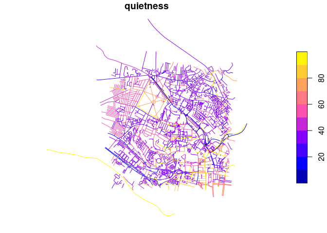

This repo contains ideas, code, and example data to estimate
‘cyclability’ on transport networks.

## What is cyclability?

There are at least three definitions of how conducive to cycling
different places, routes and segments of travel networks are:

- [Level of Traffic
  Stress](https://docs.conveyal.com/learn-more/traffic-stress) (LTS)
- [Bikeability](https://www.britishcycling.org.uk/cycletraining/article/ct20110111-cycletraining-What-is-Bikeability-0)
  levels, which rates infrastructure based on the level of training
  needed to feel comfortable:
  - Level 1 teaches basic bike-handling skills in a controlled
    traffic-free environment.
  - Level 2 teaches trainees to cycle planned routes on minor roads,
    offering a real cycling experience.
  - Level 3 ensures trainees are able to manage a variety of traffic
    conditions and is delivered on busier roads with advanced features
    and layouts
- CycleStreets’s [Quietness
  rating](https://www.cyclestreets.net/help/journey/howitworks/#quietness)
  from 1 (very unpleasant for cycling) to 100 (the quietest)
  - The [BNA tool](https://bna.peopleforbikes.org/#/) which builds on
    the concept of traffic stress to classify segments as Low Stress or
    High Stress.

## Example data

### Data from Leeds, UK

Datasets containing estimates of ‘quietness’ and ‘cyclability’ for
Leeds, UK, are available from the a separate
[repo](https://github.com/ITSLeeds/cyclability/). These datasets were
taken from an area with the following bounding box:

         xmin      ymin      xmax      ymax 
    -1.571467 53.797790 -1.541108 53.815759 

This area, representing a 1 km boundary around the University of Leeds
(-1.556288, 53.80677) can be seen in OSM at the following URL:
https://www.openstreetmap.org/#map=16/53.8068/-1.5563

<!-- To prepare the input data we used the `osmium-tool` command line utility which can be installed on Ubuntu with the following command: -->

``` bash
sudo npm install -g osmtogeojson
```

#### OSM data

OSM data was downloaded from overpass with the following command which
uses `wget` to query the API for the bounding box:

``` bash
 #| eval: false
wget -O example-data/leeds.osm "https://overpass-api.de/api/interpreter?data=[out:xml][timeout:25];(way[highway](53.797790,-1.571467,53.815759,-1.541108);node(w););out body;>;out skel qt;"
```

The output of the command above can be found in the `example-data`
folder of this repo.

``` bash
osmtogeojson example-data/leeds.osm > example-data/leeds.geojson
```

<!-- Convert this to GeoJSON with the following command (requires `osmium-tool`): -->

``` r
library(tidyverse)
leeds_osm_osm = sf::read_sf("example-data/leeds.osm", layer = "lines")
leeds_osm_geojson = sf::read_sf("example-data/leeds.geojson")
names(leeds_osm_geojson)
```

      [1] "area"                               "bicycle"                           
      [3] "bicycle:backward:conditional"       "bicycle:conditional"               
      [5] "bicycle:forward:conditional"        "bollard"                           
      [7] "cycleway:buffer"                    "foot"                              
      [9] "footway"                            "footway:surface"                   
     [11] "handrail"                           "highway"                           
     [13] "horse"                              "image"                             
     [15] "incline"                            "indoor"                            
     [17] "informal"                           "junction"                          
     [19] "junction:ref"                       "kerb"                              
     [21] "kerb:height"                        "lane_markings"                     
     [23] "lanes"                              "lanes:backward"                    
     [25] "lanes:bus"                          "lanes:bus:forward"                 
     [27] "lanes:forward"                      "lanes:left"                        
     [29] "lanes:psv"                          "lanes:psv:backward"                
     [31] "lanes:psv:forward"                  "layer"                             
     [33] "lcn"                                "level"                             
     [35] "lit"                                "material"                          
     [37] "maxheight"                          "maxspeed"                          
     [39] "maxspeed:type"                      "maxweight:signed"                  
     [41] "maxweightrating"                    "motor_vehicle"                     
     [43] "motor_vehicle:backward:conditional" "motor_vehicle:conditional"         
     [45] "motor_vehicle:forward:conditional"  "name"                              
     [47] "noexit"                             "noname"                            
     [49] "not:name"                           "not:name:note"                     
     [51] "note"                               "old_name"                          
     [53] "oneway"                             "oneway:bicycle"                    
     [55] "oneway:bus"                         "opening_date"                      
     [57] "operator"                           "operator:type"                     
     [59] "operator:wikidata"                  "parking"                           
     [61] "parking:lane:both"                  "parking:lane:left"                 
     [63] "parking:lane:right"                 "paved"                             
     [65] "police"                             "post_box:type"                     
     [67] "postal_code"                        "proposed:busway"                   
     [69] "proposed:crossing_ref"              "proposed:cycleway:left"            
     [71] "proposed:demolished:highway"        "proposed:oneway"                   
     [73] "proposed:sidewalk:left"             "proposed:sidewalk:right"           
     [75] "proposed:traffic_calming"           "proposed:turn:lanes:forward"       
     [77] "prow_ref"                           "psv"                               
     [79] "psv:backward:conditional"           "psv:conditional"                   
     [81] "psv:forward:conditional"            "psv:lanes"                         
     [83] "public_transport"                   "ramp"                              
     [85] "ramp:wheelchair"                    "ref"                               
     [87] "ref:GB:usrn"                        "royal_cypher"                      
     [89] "segregated"                         "separated"                         
     [91] "service"                            "service_1"                         
     [93] "service_times"                      "shoulder"                          
     [95] "sidewalk"                           "sidewalk:both:surface"             
     [97] "sidewalk:left"                      "sidewalk:right"                    
     [99] "sidewalk:surface"                   "smoothness"                        
    [101] "source"                             "source:maxheight"                  
    [103] "source:maxspeed"                    "source:name"                       
    [105] "source:old_name"                    "source:ref"                        
    [107] "source_ref:maxheight"               "start_date"                        
    [109] "step_count"                         "surface"                           
    [111] "survey"                             "tactile_paving"                    
    [113] "taxi"                               "temporary:oneway"                  
    [115] "towpath"                            "tracktype"                         
    [117] "traffic_calming"                    "traffic_signals"                   
    [119] "traffic_signals:direction"          "traffic_signals:sound"             
    [121] "traffic_signals:vibration"          "tunnel"                            
    [123] "turn:lanes"                         "turn:lanes:backward"               
    [125] "turn:lanes:forward"                 "website"                           
    [127] "width"                              "wikidata"                          
    [129] "wikipedia"                          "id"                                
    [131] "abutters"                           "access"                            
    [133] "access:delivery"                    "addr:city"                         
    [135] "addr:housename"                     "addr:housenumber"                  
    [137] "addr:postcode"                      "addr:street"                       
    [139] "alt_name"                           "amenity"                           
    [141] "backrest"                           "barrier"                           
    [143] "bicycle_parking"                    "brand"                             
    [145] "brand:wikidata"                     "brand:wikipedia"                   
    [147] "bridge"                             "bus"                               
    [149] "bus:lanes"                          "bus:lanes:backward"                
    [151] "bus:lanes:forward"                  "bus_bay"                           
    [153] "busway"                             "busway:left"                       
    [155] "busway:opening_hours:backward"      "busway:opening_hours:right"        
    [157] "busway:right"                       "button_operated"                   
    [159] "capacity"                           "capacity:disabled"                 
    [161] "cash_in"                            "check_date"                        
    [163] "check_date:surface"                 "check_date:tactile_paving"         
    [165] "colour"                             "construction"                      
    [167] "construction:crossing_ref"          "covered"                           
    [169] "created_by"                         "crossing"                          
    [171] "crossing:island"                    "crossing:markings"                 
    [173] "crossing_ref"                       "cycleway"                          
    [175] "cycleway:both"                      "cycleway:est_width"                
    [177] "cycleway:forward"                   "cycleway:forward:bicycle"          
    [179] "cycleway:forward:lane"              "cycleway:forward:oneway"           
    [181] "cycleway:forward:segregated"        "cycleway:forward:separation:right" 
    [183] "cycleway:forward:surface"           "cycleway:left"                     
    [185] "cycleway:left:bicycle"              "cycleway:left:lane"                
    [187] "cycleway:left:oneway"               "cycleway:left:segregated"          
    [189] "cycleway:left:separation"           "cycleway:left:separation:right"    
    [191] "cycleway:left:surface"              "cycleway:right"                    
    [193] "cycleway:right:bicycle"             "cycleway:right:lane"               
    [195] "cycleway:right:oneway"              "cycleway:right:segregated"         
    [197] "cycleway:right:separation:left"     "cycleway:right:separation:right"   
    [199] "cycleway:right:surface"             "cycleway:segregated"               
    [201] "cycleway:surface"                   "delivery"                          
    [203] "description"                        "designation"                       
    [205] "destination"                        "direction"                         
    [207] "display"                            "disused:amenity"                   
    [209] "emergency"                          "entrance"                          
    [211] "est_width"                          "exit"                              
    [213] "faces"                              "fee"                               
    [215] "fixme"                              "local_ref"                         
    [217] "lockable"                           "locked"                            
    [219] "opening_hours"                      "road_marking"                      
    [221] "support"                            "wheelchair"                        
    [223] "geometry"                          

``` r
nrow(leeds_osm_geojson)
```

    [1] 3893

``` r
nrow(leeds_osm_osm)
```

    [1] 2969

The OSM data can be seen in the map below:


The example dataset contains around 3k line segments and 200 keys with
at least one value.

#### Quietness

A GeoJSON file with quietness estimates for each road segment in Leeds
is available at
https://github.com/ITSLeeds/cyclability/raw/main/cyclestreets/leeds_quietness.geojson
and is illustrated below:

``` r
leeds_quietness = sf::read_sf("https://github.com/ITSLeeds/cyclability/raw/main/cyclestreets/leeds_quietness.geojson")
plot(leeds_quietness["quietness"])
```


``` r
leeds_quietness |>
  sf::st_drop_geometry() |>
  dplyr::slice(1:3) |>
  knitr::kable()
```

| name              | ridingSurface      |      id | cyclableText | quietness | speedMph | speedKmph | pause | color    |
|:------------------|:-------------------|--------:|:-------------|----------:|---------:|----------:|------:|:---------|
| Hanover Way       | Minor road         | 1709456 | Yes          |        40 |       16 |        26 |     0 | \#9295FF |
| Hyde Place        | Residential street | 1709460 | Yes          |        60 |       15 |        24 |     0 | \#B06840 |
| Buckingham Avenue | Residential street | 2956857 | Yes          |        40 |       15 |        24 |     0 | \#9295FF |

A simple model was used to find out the relationship between the
quietness rating and riding surface:



From this we can see that, as would be expected, living streets and
pedestrianised areas are associated with the highest quietness ratings.

## Live examples

### Network Planning Tool


Source: https://nptscot.github.io/#14.75/55.94993/-3.19227

## Prior methodological work and implementations

- The Bike Network Analysis (BNA) tool methodology:
  https://cityratings.peopleforbikes.org/about/methodology
- Discussion of cyclability in A/B Street issue tracker:
  https://github.com/a-b-street/abstreet/issues/600
- Gist in Python on GitHub calculating cyclability from OSM:
  https://gist.github.com/aroche/d6fd03e51869c3e554f908bc14b5750b
- Methods described in by CycleStreets: [Quietness
  rating](https://www.cyclestreets.net/help/journey/howitworks/#quietness)

## Thoughts on next steps (draft)

- [ ] Prototype code to generate plausible quietness ratings from
  OpenStreetMap data
- [ ] Wire up to a web interface
- [ ] Create a frontent to allow people to tweak the parameters
  affecting cyclability
- [ ] Develop default settings e.g. for different types of users
  (e.g. novice, experienced, confident) and implementations of different
  metrics (e.g. Bikeability 1 to 3 or LTS 1 to 4)
- [ ] Encode the settings that lead to these implementations in a human
  readable and easy-to-edit format, e.g. JSON
